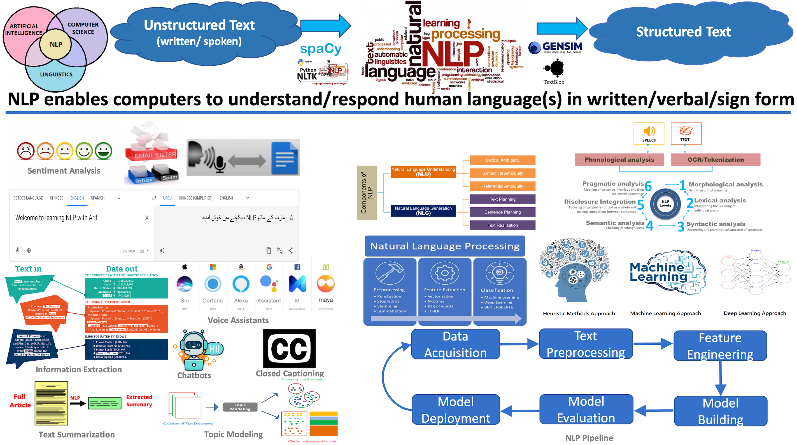
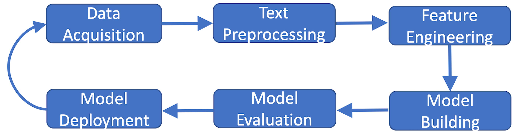
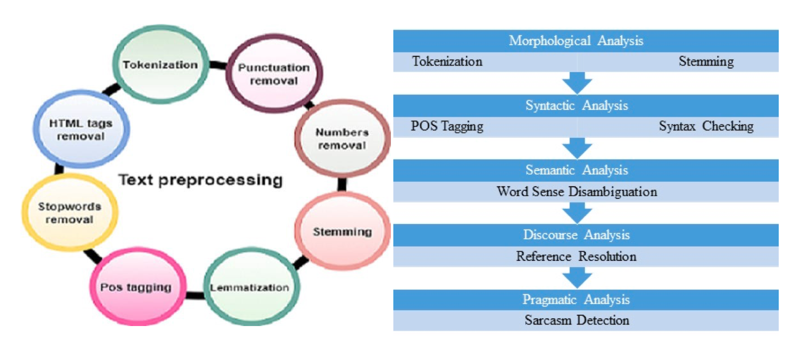

# Comprehensive Natural Language Processing (NLP) Course

  

    
Welcome to the My Comprehensive NLP Course Repository. This repository is thoughtfully curated to serve as an in-depth and advanced resource for mastering the art of Natural Language Processing (NLP). Our mission is to empower you with a profound understanding of NLP techniques, enabling you to navigate the complexities of language processing and excel in a variety of applications.

  

  

    
  

## Lecture 1: Overview of NLP and Real-World Applications

- **Overview of NLP and its Challenges**
  - Introduction to Natural Language Processing
  - Challenges in NLP

- **Real World Applications**
  - Text Classification (Spam / Fake News / Hate speech Detection)
  - Sentiment Analysis
  - Information Extraction
  - Search Engines
  - Spelling Correction and Auto Completion
  - Machine Translation
  - Contextual Advertisements
  - Text Similarity / Plagiarism Detection
  - Text Summarization
  - Topic Modeling
  - Authorship Attribution
  - Recommendation Systems
  - Chatbots
  - Voice Assistants
  - Text Generation (GPT-3) and Automated News Generation (Bloomberg)

- **Approaches Used to Solve NLP Use Cases**
  - Heuristic Method Approach
  - Machine Learning Approach
  - Deep Learning-Based Approach

## Lecture 2: NLP Pipeline

 

- **NLP Pipeline**
  - Data Acquisition
  - Text Preprocessing
  - Feature Engineering
  - Model Building
  - Model Evaluation
  - Deployment

## Lecture 3: Text Cleaning and Basic Text Preprocessing

- **Text Cleaning**
  - Removing digits and words containing digits
  - Removing newline characters and extra spaces
  - Removing HTML tags
  - Removing URLs
  - Removing punctuations

- **Basic Text Preprocessing**
  - Case folding
  - Expand contractions
  - Chat word treatment
  - Handle emojis
  - Spelling correction
  - Tokenization
  - Creating N-grams
  - Stop words Removal

- **Advanced Preprocessing**
  - Stemming
  - Lemmatization
  - POS tagging
  - Named Entity Recognition (NER)
  - Parsing
  - Coreference Resolution

- **Text Pre-Processing on Tweets Dataset**

## Lecture 4: Text Representation

- **Feature Extraction**
  - Bag of Words (BoW) Representation
  - Creating Bag of N-grams
  - Term Frequency-Inverse Document Frequency

## How to Use

1. Clone this repository to your local machine using `git clone`.
2. Explore the relevant lecture folders that interest you.
3. Review the provided code examples.
4. Run the Python code examples to see how the concepts work in practice.
5. Complete the exercises to gain hands-on experience and reinforce your understanding.
6. Utilize the content as a reference, study guide, or teaching material for NLP projects.
7. Contribute, report issues, or suggest improvements to enhance the quality of this repository further.

## Get in Touch

If you have questions, suggestions, or feedback, feel free to create an issue or reach out to me via email at [sheraz601050@gmail.com](mailto:sheraz601050@gmail.com).

---

## Happy Learning! 📚

I hope you find this repository helpful in your journey to mastering Natural Language Processing. Keep learning, practicing, and enjoy the fascinating world of NLP! 😄

**Muhammad Sheraz**